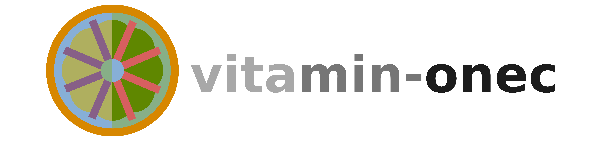
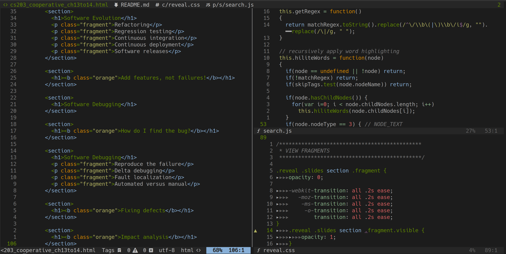
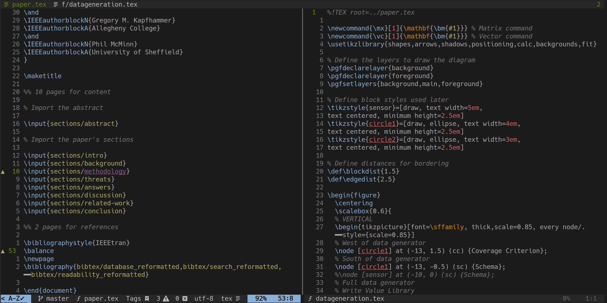
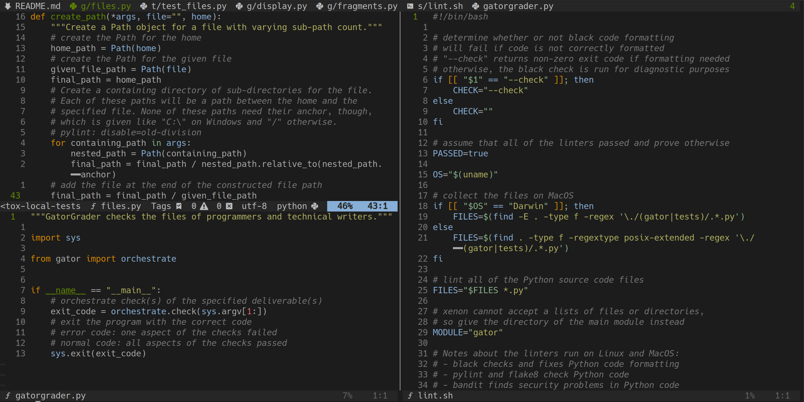

# vim-vitamin-onec



<p align="center">
<b>
A dark Vim colorscheme with vitaminic colors that promote fruitful programming
and writing
</b>
</p>

## Introduction

Featuring orange, several "fruity" colors, two shades of dark grey, and one
shade of light grey, **vim-vitamin-onec** received its name because (i) the
orange is both a meaningful highlight color and a fruit containing **vitamin**
C, (ii) the dominant grey background has a **onec** color code of `#1c1c1c`, and
(iii) the alliteration in the name makes it more fun to say. Since the
combination of those facts yielded the name "**vim-vitamin-onec**", this
colorscheme offers a vitaminic combination of bright colors and dark greys will
promote "fruitful" programming and writing.

Providing both true-color and 256-color variants, **vim-vitamin-onec** supports
Vim, Neovim, MacVim, and GVim &mdash; although the colorscheme is primarily
developed and tested with Neovim. Even though it should work in other contexts,
the colorscheme best enhances the use of Neovim during the use of the following
languages: CSS, HTML, Java, JavaScript, LaTeX, Markdown, Python, React, and
Shell. Importantly, **vim-vitamin-onec** provides highlight group definitions
for well-known Vim plugins (e.g., [Semshi's](https://github.com/numirias/semshi)
semantic highlighting of Python code).

## Screenshots

### HTML, CSS, and JavaScript



### LaTeX



### Python and Shell



## Installation

If you use [Plug](https://github.com/junegunn/vim-plug), then you can install
**vim-vitamin-onec** by using:

```vim
Plug 'gkapfham/vim-vitamin-onec'
```

You can adopt the true-color variant of **vim-vitamin-onec** by using:

```vim
" Use full color in the terminal
set termguicolors

" Display the colorscheme
colorscheme vitaminonec
```

## Plugin Configuration

The **vim-vitamin-onec** colorscheme defines highlight groups for the following
plugins or types of highlight:

- Ale
- Conceal
- Fzf
- Git-messenger
- Semshi
- Signature
- Statusline
- Quickfix

If you want the [fzf](https://github.com/junegunn/fzf) in your terminal to
match the **vim-vitamin-onec** theme, then add this to your `.zshrc` file:

```shell
export FZF_DEFAULT_OPTS='
  --bind ctrl-f:page-down,ctrl-b:page-up
  --color=fg:#a8a8a8,bg:#1c1c1c,hl:#5f8700
  --color=fg+:#afaf5f,bg+:#1c1c1c,hl+:#d78700
  --color=info:#87afd7,prompt:#87afd7,pointer:#d78700
  --color=marker:#d78700,spinner:#875f87,header:#875f87'
```

If you want your [lightline.vim](https://github.com/itchyny/lightline.vim) to
match **vim-vitamin-onec**, then add the following lines to your `.vimrc` or
`init.vim` file. Make sure that you delete `<remainder of the lighline
variable>` and add in you other configurations for this plugin!

```vim
let g:lightline = {
      \ 'colorscheme': 'vitaminonec',
      <remainder of the lightline variable>
\ }
```

## Raising an Issue

The developer of **vim-vitamin-onec** is glad that you are willing to take the
time to raise an issue documenting problems with the colorscheme. Before you do
so, please check the [Issue
Tracker](https://github.com/gkapfham/vim-vitamin-onec/issues) to make sure that
someone has not already raised your issue. If you have a new issue to raise,
then please go ahead and [raise
it](https://github.com/gkapfham/vim-vitamin-onec/issues/new/)!

## Making an Improvement

Do you want to improve **vim-vitamin-onec**? First, please consider reviewing
the [vim-wwdc16-theme](https://github.com/lifepillar/vim-wwdc16-theme) from
which it was derived. Next, install
[Colortemplate](https://github.com/lifepillar/vim-colortemplate), modify
`template/vitamin-onec.template`, and then rebuild the colorscheme using the
command `:Colortemplate!`.

The colorscheme's developer uses the [GitHub Flow
Model](https://guides.github.com/introduction/flow/) to guide the creation of
**vim-vitamin-onec**. You are invited to also follow this model as you make a
contribution through a pull request. If you have a new feature or bug fix that
you want the project maintainers to merge into **vim-vitamin-onec**, then you
should make a [Pull
Request](https://github.com/gkapfham/vim-vitamin-onec/pulls).
